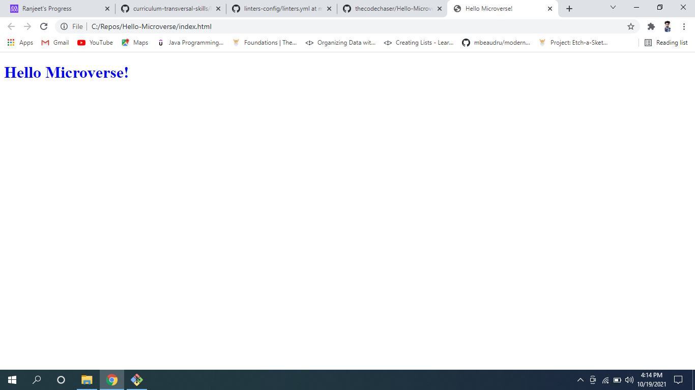

# Hello Microverse

> Hello Microverse project is introduction to well documented project in professional way

Porject's features are added into seperate branch to keep main branch safe.

## Built With

- HTML and CSS
- Github and Git

## Live Demo

[Live Demo Link](https://livedemo.com)

Live Demo link will be updated after this project is approved by Code Reviewer Tseam

## Getting Started

To get a local copy up and running follow these simple example steps.

### Prerequisites

### Setup

### Install

### Usage

### Run tests

### Deployment

## Authors

👤 **Ranjeet Singh**

- GitHub: [@githubhandle](https://github.com/thecodechaser)
- Twitter: [@twitterhandle](https://twitter.com/thecodechaser)
- LinkedIn: [LinkedIn](https://linkedin.com/in/thecodechaser)

## 🤝 Contributing

Contributions, issues, and feature requests are welcome!

Feel free to check the [issues page](https://github.com/thecodechaser/Hello-Microverse/issues).

## Show your support

Give a ⭐️ if you like this project!

## Acknowledgments

- Inspiration: Microverse

## 📝 License

This project is [MIT](./MIT.md) licensed.